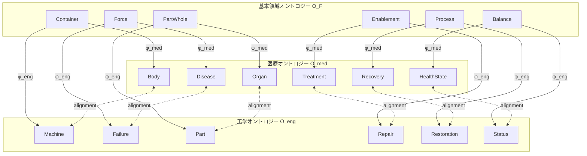
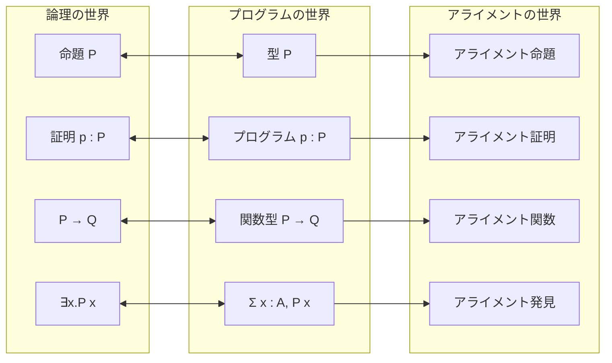
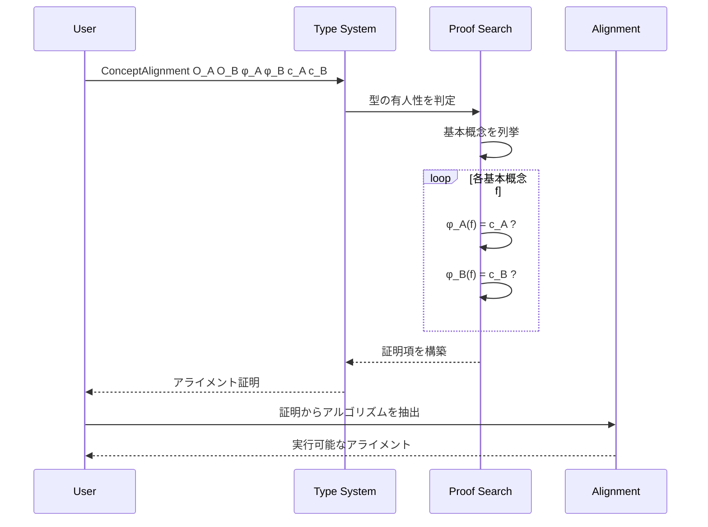
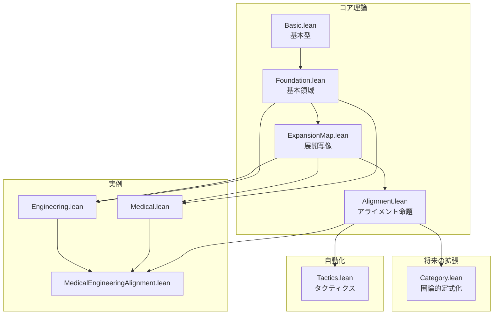
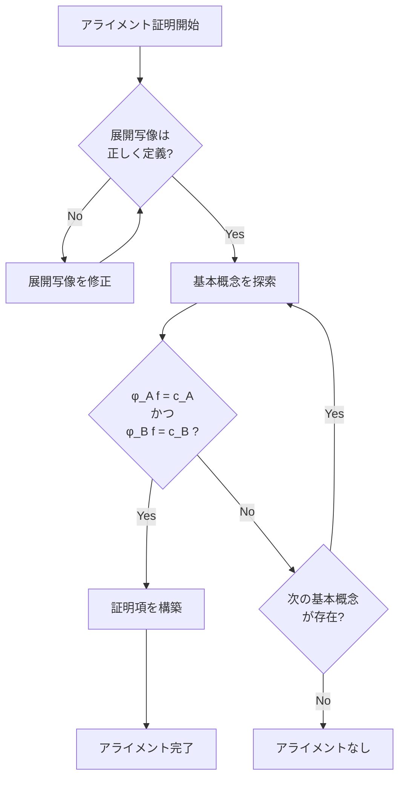

# 理論概要図

## 1. メタファー的アライメントの全体像



## 2. Curry-Howard対応の活用



## 3. アライメント計算の流れ



## 4. プロジェクト構造



## 5. 型階層

```
Universe
└── Type
    └── Ontology
        ├── Concept : Type
        ├── Relation : Concept → Concept → Type
        └── decEq : DecidableEq Concept
    
    └── ExpansionMap (O_F → O_D)
        ├── conceptMap : O_F.Concept → O_D.Concept
        └── relationPreserve : ∀ r, O_F.Relation → O_D.Relation
    
    └── ConceptAlignment (O_A, O_B, φ_A, φ_B, c_A, c_B)
        ├── foundationWitness : FoundationConcept
        ├── fromA : φ_A.conceptMap f = c_A
        └── fromB : φ_B.conceptMap f = c_B
```

## 6. 証明戦略


